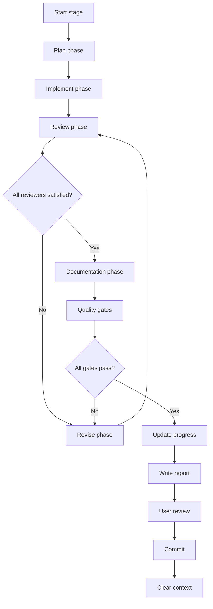

Create a comprehensive multi-stage implementation plan for the specification at: $ARGUMENTS

## Phase 1: Exploration

Before creating the plan, understand the codebase context by launching **Explore agents in parallel** using the Task tool:

**Launch these 3 Explore agents in a single message (parallel execution):**

1. **Codebase structure explorer**
   ```
   Explore the overall structure of this codebase:
   - What is the project architecture? (src/ layout, module organization)
   - What patterns are used for CLI commands? (look in src/rig/commands/)
   - How are tests organized? (tests/unit/, tests/properties/, tests/integration/)
   - What existing features exist that the new feature might depend on or integrate with?
   ```

2. **Related implementation explorer**
   ```
   Search for existing implementations similar to the feature in the spec at: $ARGUMENTS
   - Are there existing modules that this feature will extend or depend on?
   - What patterns have been used for similar functionality?
   - What shared utilities or base classes exist?
   - Look for any existing code that touches the same domain.
   ```

3. **Testing patterns explorer**
   ```
   Explore testing patterns in this codebase:
   - How are unit tests structured?
   - Are there property-based tests using Hypothesis? What strategies exist?
   - How are integration tests organized?
   - What test fixtures and conftest.py patterns are used?
   ```

**Wait for all exploration results before proceeding.**

## Phase 2: Spec validation

1. **Read the specification file** at $ARGUMENTS thoroughly
2. **Use `documentation-reviewer` agent** to validate the spec follows project standards
   - Fix any issues before proceeding (ASCII diagrams → Mermaid, missing TOC, etc.)

## Phase 3: Stage design

Launch **Plan agents in parallel** using the Task tool to get different perspectives on stage breakdown:

**Launch 2 Plan agents in a single message (parallel execution):**

1. **Minimal stages perspective**
   - Design stages with focus on minimizing total count
   - Which features can be combined without creating overly complex stages?
   - What are the critical dependencies that force ordering?
   - Output: Proposed stage list with dependencies and rationale

2. **Granular stages perspective**
   - Design stages with focus on independent, testable units
   - Which stages could potentially run in parallel?
   - Where are the natural boundaries in the spec?
   - Output: Proposed stage list with dependencies and rationale

**Synthesize the perspectives** to create the final stage breakdown:
- Balance granularity with practical stage count
- Stage 0 must cover all foundation types/data structures
- Final stage must be integration testing and acceptance
- Identify which middle stages can run in parallel

## Phase 4: Plan generation

Using insights from exploration and stage design:

1. **Create the plan directory** at `plans/<feature-name>/`
2. **Generate all plan files** using the templates below

Incorporate codebase-specific details discovered during exploration:
- Actual module paths that will be created/modified
- Existing patterns to follow
- Shared utilities to reuse
- Test fixtures that already exist

## Output files

Create these files, substituting `<feature>` with the feature name derived from the spec:

### 1. `plans/<feature>/plan.md`

```markdown
# <Feature> implementation plan

This plan implements the <feature> system specified in `specs/<spec-file>.md`.

## Table of contents

- [Overview](#overview)
- [Stages](#stages)
- [Workflow](#workflow)
- [Agent loop](#agent-loop)
- [Skills](#skills)
- [Quality gates](#quality-gates)
- [Commit template](#commit-template)
- [Progress tracking](#progress-tracking)
- [Documentation requirements](#documentation-requirements)
- [Report template](#report-template)
- [Lessons learned](#lessons-learned)

## Overview

<Brief description of what this feature provides>

**Note**: <Any scope deferrals or constraints>

## Stages

| Stage | File | Description | Depends on |
|-------|------|-------------|------------|
| 0 | [stage-0-<name>.md](./stage-0-<name>.md) | <description> | - |
| ... | ... | ... | ... |
| N | [stage-N-final-review.md](./stage-N-final-review.md) | Integration testing and acceptance | <all previous> |

## Workflow

Each stage follows this workflow:



### Phase descriptions

1. **Plan phase**: Use `code-architect` agent to design the implementation approach
2. **Implement phase**: Use `code-architect` agent to implement the design
3. **Review phase**: Use reviewer agents to assess the implementation
4. **Revise phase**: Use `refactoring-architect` agent to address feedback
5. **Documentation phase**: Use `documentation-architect` agent to update `docs/`
6. **Quality gates**: Run all checks (types, lint, tests, coverage)
7. **Update progress**: Mark stage complete in this file and stage file
8. **Write report**: Create detailed report in `reports/` directory
9. **User review**: Present summary and request user approval before commit
10. **Commit**: Single commit for the stage (only after user approval)
11. **Clear context**: End session, next stage starts fresh

## Agent loop

Each stage uses this agent loop until all designated reviewers are satisfied.

**CRITICAL: The main session acts ONLY as a coordinator.** The main session must NOT:

- Write any production code directly
- Write any test code directly
- Write any documentation directly
- Make any file edits except to update progress tracking in plan files

The main session MUST delegate ALL implementation work to agents.

### Main session responsibilities

1. Read plan and stage files to understand current state
2. Invoke agents with appropriate context and instructions
3. Run quality gates (`just lint && just test`)
4. Update progress tracking in plan files
5. Create commits when stages complete

### Planning agents

- `code-architect`: Design implementation approach, identify patterns, create detailed implementation plan

### Implementation agents

- `code-architect`: Implement ALL production code (pass stage file, plan, and spec as context)
- `test-architect`: Implement ALL tests (unit tests and property-based tests)

### Review agents

- `code-reviewer`: Standards compliance, code quality
- `test-architect`: Test coverage, property-based testing opportunities
- `documentation-reviewer`: Documentation quality (after docs phase)

### Revision agents

- `refactoring-architect`: Address code review feedback
- `test-architect`: Address test coverage feedback

### Documentation agents

- `documentation-architect`: Create/update user documentation in `docs/`
- `documentation-reviewer`: Verify documentation quality

### Agent invocation pattern

When invoking an agent, provide:

1. The task description
2. Reference to relevant files (stage file, plan.md, spec)
3. Specific deliverables expected
4. Skills to activate
5. Quality criteria to meet

## Skills

Activate these skills during implementation:

| Skill | When to use |
|-------|-------------|
| `python-dev-practices` | All Python code |
| `type-safety` | Type hints, TypedDict, Protocol |
| `dataclass-patterns` | Data structures |
| `error-handling` | Validation errors, user-facing messages |
| `testing-practices` | Unit tests, fixtures |
| `hypothesis-strategies` | Property-based tests |
| `security-practices` | Path handling, file operations |
| `shell-dev-practices` | Shell command execution |

## Quality gates

All must pass before a stage is complete:

1. **Type checking**: `uv run basedpyright` - zero errors
2. **Linting**: `uv run ruff check .` - all checks pass
3. **Formatting**: `uv run ruff format --check .` - no changes needed
4. **Spelling**: `uv run codespell` - no errors
5. **Tests**: `uv run pytest` - all pass
6. **Coverage**: >95% for new code
7. **Documentation**: Updated in `docs/` for user-facing features

Run all gates with: `just lint && just test`

## Commit template

Each stage results in a single commit using this format:

```
feat(<scope>): <brief description>

<detailed description of what was implemented>

- <bullet point of key change>
- <bullet point of key change>
- <bullet point of key change>

🤖 Generated with [Claude Code](https://claude.com/claude-code)

Co-Authored-By: Claude <noreply@anthropic.com>
```

**Important**: Commit messages describe what was done, NOT reference the plan or spec.

## Progress tracking

Update this section as stages complete:

### Stage status

| Stage | Status | Commit | Report |
|-------|--------|--------|--------|
| 0 | pending | - | - |
| ... | pending | - | - |
| N | pending | - | - |

### Completion checklist

For each stage, verify:

- [ ] All quality gates pass
- [ ] Documentation updated in `docs/`
- [ ] Stage file updated with completion status
- [ ] Report written to `reports/`
- [ ] Single commit created
- [ ] This table updated

## Documentation requirements

Each stage must update documentation in `docs/`:

1. **User guide**: How to use the feature (`docs/<feature>.md`)
2. **API reference**: Public API documentation (docstrings)
3. **Examples**: Working examples in documentation

Documentation must follow project standards:

- Sentence case headlines only
- Mermaid.js diagrams (no ASCII art)
- Google-style docstrings
- Complete, tested examples

Use `documentation-reviewer` agent after writing docs.

## Report template

Each stage writes a report to `plans/<feature>/reports/stage-N-report-YYYY-MM-DD.md`:

```markdown
# Stage N report - <stage name>

**Date**: YYYY-MM-DD
**Status**: Complete
**Commit**: <short hash>

## Summary

<2-3 sentence summary of what was accomplished>

## Implementation details

### Files created

- `path/to/file.py`: <description>

### Files modified

- `path/to/file.py`: <description of changes>

## Design decisions

### <Decision title>

**Context**: <why this decision was needed>
**Decision**: <what was decided>
**Alternatives considered**: <other options>
**Rationale**: <why this choice>

## Test coverage

- Unit tests: N tests
- Property tests: N tests
- Coverage: N%

## Review feedback addressed

- <feedback item>: <how addressed>

## Documentation updates

- `docs/<feature>.md`: <what was added/changed>

## Quality gate results

- Type checking: PASS
- Linting: PASS
- Tests: PASS (N passed)
- Coverage: N%

## Next stage preparation

<Any notes for the next stage>
```

## Lessons learned

Guidance from completed stages:

1. **Don't write useless tests that just "test the framework"**: Tests should verify actual behavior and edge cases, not simply confirm that Python dataclasses or pytest fixtures work as expected. Every test should have a clear purpose tied to the implementation.

2. **Don't commit anything in the plans directory**: Plan files, reports, and progress updates in `plans/` are working documents that track the implementation process but should not be included in stage commits. Only commit production code, tests, and documentation in `docs/`.
```

### 2. `plans/<feature>/stage-0-<name>.md`

Stage 0 should always be the foundation stage. Include:

```markdown
# Stage 0 - <Foundation/Core name>

**Status**: pending
**Depends on**: None
**Estimated complexity**: <Low/Medium/High>

## Objective

<What this stage accomplishes - typically core data structures and types>

## Reference

See [plan.md](./plan.md) for workflow, quality gates, and commit template.

## Scope

### Deliverables

1. `src/rig/<feature>/__init__.py` - Public API exports
2. `src/rig/<feature>/_types.py` - Type definitions and enums
3. `src/rig/<feature>/_schema.py` - Core data structures
4. `tests/unit/<feature>/test_<name>.py` - Unit tests
5. `tests/properties/<feature>/test_<name>_properties.py` - Property-based tests
6. `tests/integration/<feature>/test_<feature>_integration.py` - Integration test suite (xfail)
7. `tests/integration/<feature>/conftest.py` - Integration test fixtures

### Out of scope

<What's NOT included - list subsequent stage features>

## Technical requirements

<Detailed requirements with code examples>

## Skills to activate

- `python-dev-practices`
- `type-safety`
- `dataclass-patterns`
- `testing-practices`
- `hypothesis-strategies`

## Agent loop

### Planning phase
Use `code-architect` agent to design dataclass hierarchy and identify validation requirements.

### Implementation phase
Use `code-architect` agent to create module structure and implement types/schema.
Use `test-architect` agent to create unit tests, property tests, and integration test suite with xfail markers.

### Review phase
Use `code-reviewer` and `test-architect` agents until satisfied.

### Revision phase
Use `refactoring-architect` agent to address feedback.

### Documentation phase
Use `documentation-architect` agent to add docstrings and create initial `docs/<feature>.md`.

## Acceptance criteria

- [ ] All dataclasses are frozen with slots
- [ ] All fields have type hints
- [ ] Default values match spec
- [ ] Unit tests cover all dataclass creation
- [ ] Property tests verify immutability
- [ ] Integration test suite created with xfail markers
- [ ] Integration tests cover all end-to-end scenarios
- [ ] >95% coverage for new code
- [ ] All quality gates pass

## Completion

When complete, update:

1. This file: Change status to `complete`, add commit hash
2. `plan.md`: Update stage status table
3. Write report to `plans/<feature>/reports/stage-0-report-YYYY-MM-DD.md`

### Completion status

- **Status**: pending
- **Commit**: -
- **Report**: -
- **Completed**: -
```

### 3. Subsequent stage files

Follow the same structure as Stage 0, but:
- Update dependencies
- List stage-specific deliverables
- Include stage-specific technical requirements
- Note which xfail markers to remove

### 4. Final stage file

The last stage should be `stage-N-final-review.md` covering:
- Code review of entire implementation
- Test architecture review
- Documentation review
- Exploratory acceptance testing
- API consistency verification against spec
- PR description creation
- All xfail markers removed

### 5. `plans/<feature>/prompts.md`

Create a prompt for each stage following this pattern:

```markdown
# Stage initiation prompts

Copy and paste the appropriate prompt to start each stage. Each stage should be run in a fresh Claude Code session to ensure context is cleared between stages.

## Stage 0 - <name>

```
Execute Stage 0 of the <feature> implementation plan.

**CRITICAL: You are a COORDINATOR ONLY.** Do NOT write any code, tests, or documentation directly. Delegate ALL implementation work to agents.

Read the plan at `plans/<feature>/plan.md` and stage details at `plans/<feature>/stage-0-<name>.md`.

Your responsibilities:
1. Invoke agents to do work
2. Run quality gates (`just lint && just test`)
3. Update progress tracking in plan files
4. Create the commit when complete

Workflow:

1. **Plan phase**: Invoke `code-architect` agent to design the implementation
   - Provide: stage file, plan.md, specs/<spec>.md as context
   - Request: detailed implementation plan

2. **Implement phase**: Invoke agents to implement
   - Invoke `code-architect` agent to create production code
   - Invoke `test-architect` agent to create tests

3. **Review phase**: Invoke reviewer agents
   - Invoke `code-reviewer` agent to review implementation
   - Invoke `test-architect` agent to review test coverage
   - Loop until both are satisfied

4. **Revise phase**: If reviewers have feedback
   - Invoke `refactoring-architect` agent to address feedback
   - Return to review phase

5. **Documentation phase**: Invoke documentation agents
   - Invoke `documentation-architect` agent to add docstrings and create/update docs
   - Invoke `documentation-reviewer` agent to verify

6. **Quality gates**: Run `just lint && just test`
   - If failures, invoke appropriate agent to fix
   - Ensure >95% coverage

When all gates pass:
1. Update stage file with completion status
2. Update plan.md stage status table
3. Invoke an agent to write report to plans/<feature>/reports/stage-0-report-YYYY-MM-DD.md
4. Present a summary of what was accomplished and request user approval
5. Only after user approves, create single commit using template from plan.md

Do not proceed to Stage 1. End session after commit.
```

## Stage 1 - <name>

<Similar prompt with stage-specific details>

...
```

### 6. `plans/<feature>/reports/`

Create an empty directory for reports:

```bash
mkdir -p plans/<feature>/reports
```

## Stage design guidelines

When analyzing the spec to identify stages:

1. **Stage 0**: Always foundation - core types, enums, data structures
2. **Early stages**: Internal APIs and data handling (parsing, validation, merging)
3. **Middle stages**: External interfaces (CLI commands, file I/O)
4. **Parallel stages**: Features that depend on the same base but not each other
5. **Final stage**: Always integration testing and acceptance

## Critical rules

1. **Integration tests from Stage 0** - Create the full integration test suite with xfail markers in Stage 0
2. **One commit per stage** - Each stage results in exactly one commit
3. **User approval required** - Always get user approval before committing
4. **No plan files in commits** - Plan files track progress but aren't committed with stage work
5. **Reports in plan folder** - Write to `plans/<feature>/reports/`, not repo root
6. **Coordinator only** - Main session delegates ALL implementation to agents

## Output

After creating all plan files:

1. Summarize the stages and their dependencies
2. Show a dependency graph if stages can run in parallel
3. Note any scope that was deferred from the spec
4. Confirm the plan is ready for Stage 0 to begin
