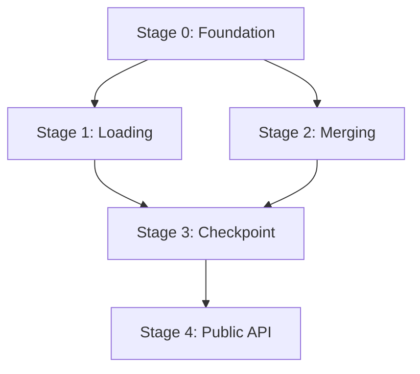

Use the @agent-specification-architect agent to **review implementation plans** at: $ARGUMENTS

If no path specified, list available plans in `plans/` and ask user to specify which to review.

## Review scope

This review evaluates plan quality across multiple dimensions:

### Structural compliance

- **Format adherence**: Follows multi-stage plan template from `plan/create-multi-stage`
- **Completeness**: All required sections present (objectives, scope, requirements, acceptance criteria)
- **Consistency**: Plan files reference each other correctly
- **Dependencies**: Stage dependencies are explicit and correct

### Technical quality

- **Requirements clarity**: Technical requirements are specific, testable, and complete
- **Scope definition**: Clear boundaries between in-scope and out-of-scope
- **Test coverage**: Comprehensive test scenarios from stage 0 onwards
- **Integration tests**: xfail markers used appropriately from foundation stage
- **Skills activation**: Correct skills specified for each stage

### Process alignment

- **Agent loop**: Proper delegation to specialized agents
- **Quality gates**: Appropriate gates defined and enforced
- **Documentation**: Documentation phase included for each stage
- **Commit strategy**: Single commit per stage with proper template
- **Progress tracking**: Clear status tracking mechanism

### Strategic quality

- **Stage breakdown**: Logical progression with appropriate granularity
- **Parallelization**: Parallel stages identified where appropriate
- **Checkpoints**: PR checkpoints at key integration points
- **Dependencies**: External dependencies identified (e.g., other plans)
- **Risk management**: Edge cases and complexity factors addressed

## Review types

### Full plan review

When given a plan directory (e.g., `plans/rig-config/`):

1. Read `plan.md` to understand overall structure
2. Review each stage file sequentially
3. Check prompts in `prompts.md` for correctness
4. Verify reports directory exists
5. Assess stage dependencies and ordering
6. Identify any gaps or inconsistencies across stages

### Single stage review

When given a specific stage file (e.g., `plans/rig-config/stage-4-public-api.md`):

1. Read the parent `plan.md` for context
2. Review the specified stage in depth
3. Check dependencies are satisfied by previous stages
4. Verify acceptance criteria are comprehensive
5. Assess test scenario coverage

### Multi-file review

When given multiple stage files or a range:

1. Review each specified stage
2. Check dependencies flow correctly
3. Verify no gaps between stages
4. Assess consistency in structure and quality

## Standards references

Review against these standards:

- `.claude/commands/plan/create-multi-stage.md` - Multi-stage plan template
- `.claude/standards/design-principles.md` - Design principles (SOLID, DRY, YAGNI, KISS)
- `.claude/standards/quality-gates.md` - Quality requirements
- `.claude/standards/test-standards.md` - Test organization
- `.claude/standards/documentation-standards.md` - Documentation requirements

## Critical constraints

- **NEVER** modify plan files during review (read-only assessment)
- **MUST** reference specific file paths and line numbers in feedback
- **MUST** distinguish severity: CRITICAL (must fix), IMPORTANT (should fix), OPTIONAL (nice to have)
- **FLAG** these as CRITICAL issues:
  - Missing integration tests in stage 0
  - Missing xfail markers in early stages
  - Direct implementation instead of agent delegation
  - Plan files included in commit strategy
  - Missing quality gates or documentation phases
  - Undefined dependencies between stages

## Methodology

### Phase 1: Discovery

1. **Identify scope**: Determine what files to review based on arguments
2. **Read context**: Understand plan structure and objectives
3. **Map dependencies**: Build mental model of stage relationships

### Phase 2: Detailed analysis

For each plan/stage file:

1. **Structure check**: Verify required sections exist
2. **Completeness check**: Assess technical requirements and acceptance criteria
3. **Quality check**: Evaluate clarity, testability, and appropriateness
4. **Process check**: Verify agent loop, quality gates, documentation phases
5. **Integration check**: Ensure stages connect properly

### Phase 3: Synthesis

1. **Categorize findings**: Group by severity and type
2. **Identify patterns**: Note recurring issues or strengths
3. **Prioritize recommendations**: Order by impact and urgency
4. **Suggest improvements**: Provide specific, actionable feedback

## Output format

Save review to `reviews/plan-review-<plan-name>-YYYY-MM-DD-HHmmss.md`:

```markdown
# Plan review - [Plan name] - [Date/Time]

## Summary

[High-level assessment: Is this plan ready for execution? Key strengths and critical gaps]

## Scope

- **Plan directory**: `plans/<name>/`
- **Files reviewed**:
  - `plan.md`
  - `stage-0-<name>.md`
  - `stage-N-<name>.md`
  - `prompts.md`
- **Review type**: [Full plan / Single stage / Multi-file]

## Critical issues (MUST FIX before execution)

### [Issue category]

**Location**: `plans/<name>/stage-N-<name>.md:123`
**Severity**: CRITICAL
**Issue**: [Specific problem]
**Impact**: [What will happen if not fixed]
**Recommendation**: [Concrete fix]

[Repeat for each critical issue]

## Important suggestions (SHOULD FIX for quality)

### [Suggestion category]

**Location**: `plans/<name>/stage-N-<name>.md:456`
**Severity**: IMPORTANT
**Issue**: [Quality concern]
**Impact**: [Effect on execution or maintainability]
**Recommendation**: [How to improve]

[Repeat for each important suggestion]

## Optional improvements (NICE TO HAVE)

### [Enhancement area]

**Location**: `plans/<name>/stage-N-<name>.md:789`
**Severity**: OPTIONAL
**Issue**: [Minor enhancement opportunity]
**Benefit**: [What would improve]
**Recommendation**: [Possible enhancement]

[Repeat for each optional improvement]

## Positive observations

### [Strength category]

**Location**: `plans/<name>/stage-N-<name>.md:321`
**Observation**: [Well-executed pattern or decision]
**Why it works**: [Explanation of effectiveness]

[Repeat for notable strengths]

## Stage-by-stage assessment

### Stage 0 - [Name]

- **Status**: [Ready / Needs work]
- **Strengths**: [What's done well]
- **Concerns**: [Issues to address]
- **Integration tests**: [Present with xfail / Missing / Incomplete]

### Stage N - [Name]

[Same structure]

## Compliance checklist

Template compliance:

- [ ] Follows multi-stage plan template structure
- [ ] All required sections present in each stage
- [ ] `plan.md` includes all required sections
- [ ] `prompts.md` provides stage initiation prompts
- [ ] Reports directory exists

Technical quality:

- [ ] Technical requirements are specific and testable
- [ ] Acceptance criteria are comprehensive
- [ ] Test scenarios cover edge cases
- [ ] Integration tests present from stage 0
- [ ] xfail markers used appropriately

Process alignment:

- [ ] Agent loop properly delegates to agents
- [ ] Main session acts as coordinator only
- [ ] Quality gates defined and appropriate
- [ ] Documentation phase in each stage
- [ ] Single commit per stage strategy
- [ ] Progress tracking mechanism clear

Strategic quality:

- [ ] Stage breakdown is logical
- [ ] Dependencies correctly identified
- [ ] Parallel stages identified where appropriate
- [ ] PR checkpoints at key integration points
- [ ] External dependencies noted
- [ ] Risks and complexity addressed

## Dependency graph

[If reviewing full plan, include a visual representation of stage dependencies using Mermaid]



## Recommendations

### Immediate actions (before starting stage 0)

1. [Priority 1 fix]
2. [Priority 2 fix]

### Quality improvements (before execution)

1. [Quality improvement 1]
2. [Quality improvement 2]

### Long-term considerations (for future plans)

1. [Learning or pattern to apply]
2. [Process improvement]

## Overall assessment

**Ready for execution**: [YES / NO / CONDITIONAL]

**Conditions** (if conditional):

- [Condition 1 that must be met]
- [Condition 2 that must be met]

**Recommendation**: [Clear next step - fix and re-review, start execution, or major revision needed]

```

## Special cases

### Reviewing in-progress plans

If reviewing a plan that's partially complete:

1. Check completed stages against their reports
2. Verify progress tracking is accurate
3. Assess whether completed work matches plan
4. Review remaining stages for continued relevance
5. Flag any drift between plan and implementation

### Reviewing checkpoint stages

For stages that create PRs (e.g., `stage-4-public-api.md` with PR checkpoint):

1. Verify PR checkpoint is at logical integration point
2. Check pre-flight checks are comprehensive
3. Review troubleshooting loop completeness
4. Ensure changelog update is included
5. Assess PR description template quality

### Cross-plan dependencies

When plans reference other plans (e.g., `plans/rig-config` is dependency for `plans/worktree`):

1. Identify cross-plan dependencies explicitly
2. Verify dependency plan status
3. Check interface contracts are clear
4. Flag if dependency plan has critical issues
5. Recommend coordination strategy

## Usage examples

### Review entire plan

```bash
/plan/review plans/rig-config
```

Reviews all stages, plan.md, prompts.md in the rig-config plan.

### Review specific stage

```bash
/plan/review plans/rig-config/stage-4-public-api.md
```

Reviews just stage 4 with context from plan.md.

### Review multiple stages

```bash
/plan/review plans/rig-config/stage-0-foundation.md plans/rig-config/stage-1-loading.md
```

Reviews stages 0 and 1, checking dependency flow.

### Review with no arguments

```bash
/plan/review
```

Lists available plans and prompts for selection.
