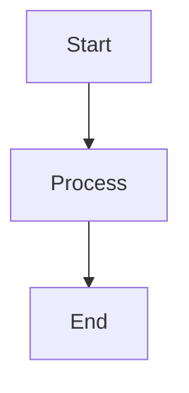
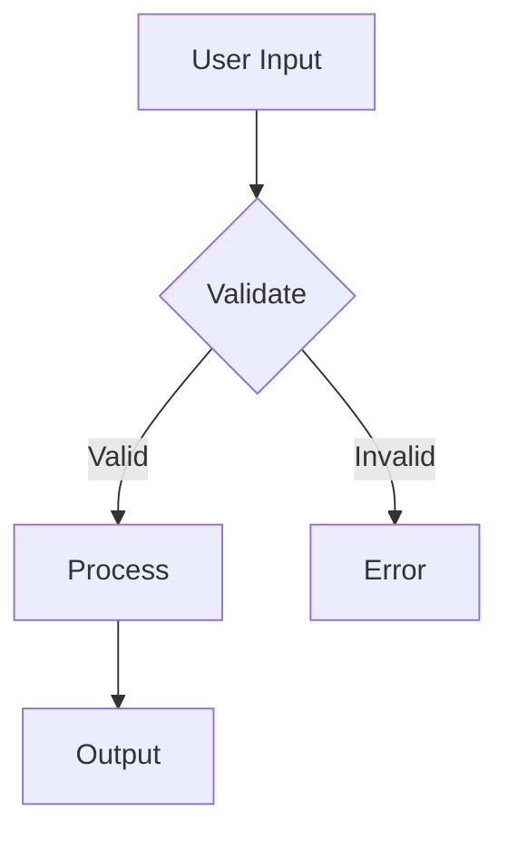
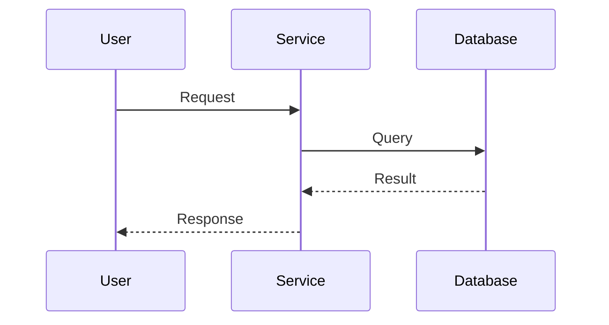
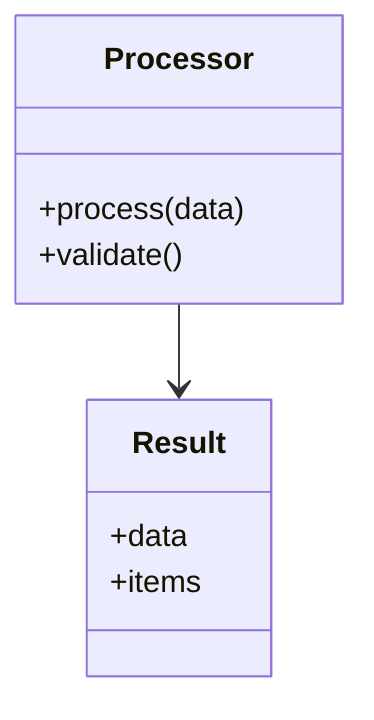
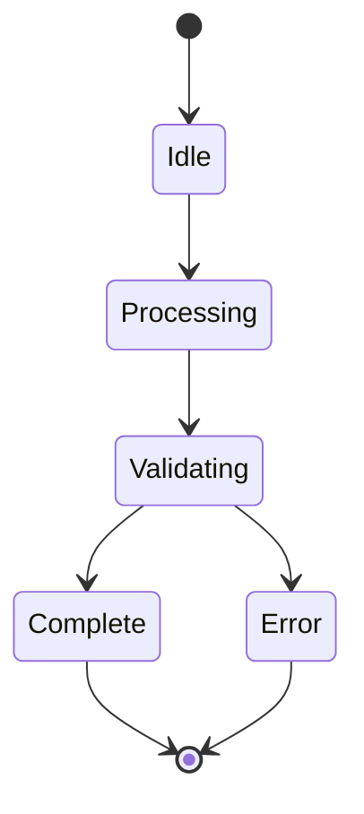
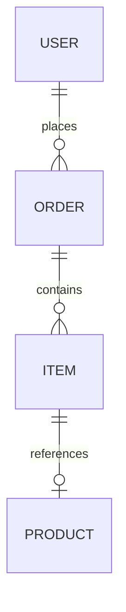
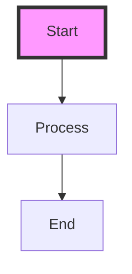
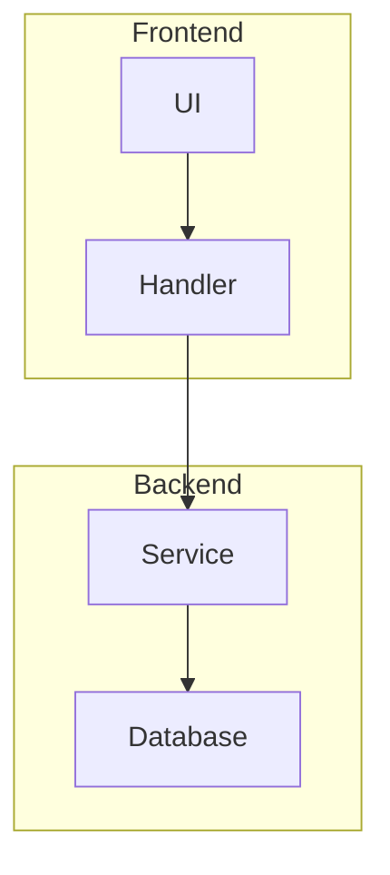
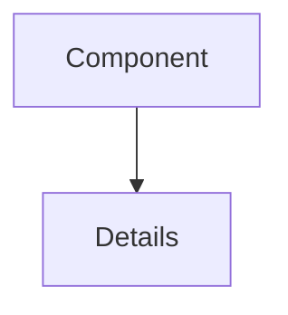

# Diagram requirements

**MANDATORY: ALWAYS use Mermaid.js for ALL diagrams**

## Core requirement

**CRITICAL: NEVER create ASCII art diagrams**

ALL diagrams MUST use Mermaid.js syntax:

- Flowcharts
- Sequence diagrams
- Class diagrams
- State diagrams
- ER diagrams
- User journey diagrams
- Gantt charts
- Pie charts
- Git graphs

## Basic usage

### In Markdown files

Use mermaid code blocks:

````markdown

````

### Rendering diagrams

```bash
# Render diagram alongside source
just mermaid -i diagram.mmd -o diagram.svg

# Or render as PNG
just mermaid -i diagram.mmd -o diagram.png
```

## Common diagram types

### Flowchart (data flow)



Use for:

- Data flow diagrams
- Process flows
- Decision trees

### Sequence diagram (interactions)



Use for:

- Component interactions
- API call flows
- Process workflows

### Class diagram (structure)



Use for:

- System architecture
- Component relationships
- Type hierarchies

### State diagram (state machines)



Use for:

- State machines
- Lifecycle diagrams
- Process states

### ER diagram (data models)



Use for:

- Data relationships
- Entity models
- Schema diagrams

## When to use diagrams

**Use Mermaid diagrams when:**

- Explaining complex data flows
- Documenting system architecture
- Showing component relationships
- Illustrating process workflows
- Visualizing state machines
- Describing interaction sequences

**Examples of appropriate usage:**

- Data flow -> Mermaid flowchart
- System architecture -> Mermaid component/class diagram
- Process workflows -> Mermaid sequence or state diagram
- Component relationships -> Mermaid class or ER diagram

## Documentation integration

### Include both source and rendered

In documentation repositories:

1. Create source diagram: `diagram.mmd`
2. Render to image: `just mermaid -i diagram.mmd -o diagram.svg`
3. Include both in repository
4. Reference SVG in markdown:

```markdown


Source: [architecture.mmd](architecture.mmd)
```

### In agent reviews

When creating diagrams in reviews:

1. Use Mermaid code blocks directly in markdown
2. Optionally render to SVG for better visibility
3. Include source in review file

## Common mistakes

### WRONG - ASCII art

```text
  +----------+
  |  Start   |
  +----+-----+
       |
       v
  +----------+
  | Process  |
  +----+-----+
       |
       v
  +----------+
  |   End    |
  +----------+
```

**Problems:**

- Hard to maintain
- Doesn't render well
- No semantic meaning
- Breaks with different fonts

### CORRECT - Mermaid.js

````markdown

````

**Benefits:**

- Easy to maintain
- Renders beautifully
- Semantic structure
- Consistent appearance

## Advanced features

### Styling



### Subgraphs



### Links



## References

For complete Mermaid.js syntax:

- Official docs: <https://mermaid.js.org/>
- Live editor: <https://mermaid.live/>
- Flowchart syntax: <https://mermaid.js.org/syntax/flowchart.html>
- Sequence diagrams: <https://mermaid.js.org/syntax/sequenceDiagram.html>
- Class diagrams: <https://mermaid.js.org/syntax/classDiagram.html>
- State diagrams: <https://mermaid.js.org/syntax/stateDiagram.html>
