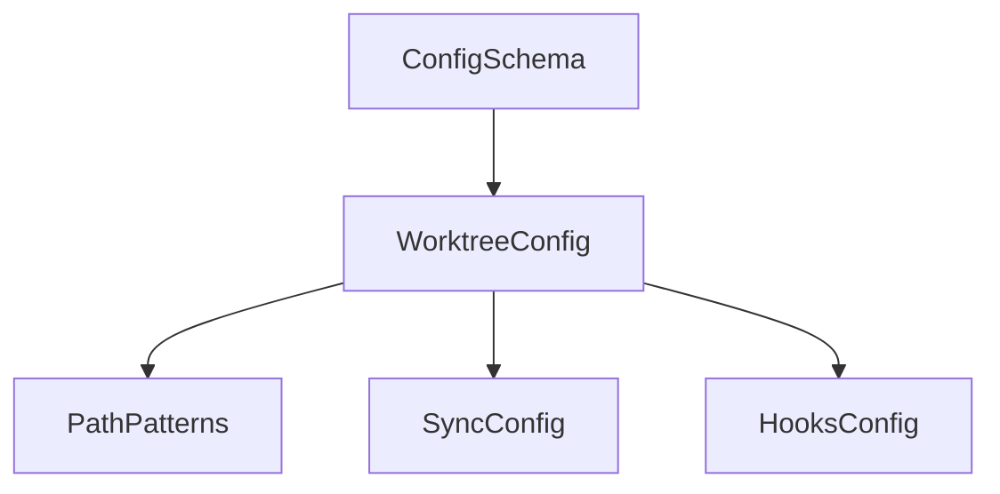

# Configuration

Rig uses a layered TOML configuration system that supports user-wide defaults, directory-based project groups, and project-specific settings. Configuration is represented internally using immutable dataclasses that can be inspected and used programmatically.

## Overview

The configuration system is built around frozen dataclasses that represent the schema. All configuration objects are immutable once created, which ensures thread safety and prevents accidental modification.

```python
from rig.config import ConfigSchema, WorktreeConfig

# Create a config with defaults
config = ConfigSchema()

# Access nested settings
print(config.worktree.default_location)  # "sibling"
print(config.worktree.delete_branch)     # True

# Create with custom values
custom = ConfigSchema(
    worktree=WorktreeConfig(
        default_location="local",
        delete_branch=False,
    )
)
```

## Schema reference

The configuration schema is organized hierarchically:



### ConfigSchema

The root configuration container. Currently contains only worktree configuration but is structured to allow future expansion.

```python
from dataclasses import dataclass, field

@dataclass(slots=True, frozen=True)
class ConfigSchema:
    worktree: WorktreeConfig = field(default_factory=WorktreeConfig)
```

**Attributes:**

| Attribute | Type | Default | Description |
|-----------|------|---------|-------------|
| `worktree` | `WorktreeConfig` | `WorktreeConfig()` | Worktree management configuration |

### WorktreeConfig

Contains all settings related to worktree creation, sync behavior, and lifecycle hooks.

```python
from dataclasses import dataclass, field
from typing import Literal

@dataclass(slots=True, frozen=True)
class WorktreeConfig:
    default_location: Literal["sibling", "local"] = "sibling"
    delete_branch: bool = True
    protected: bool = False
    paths: PathPatterns = field(default_factory=PathPatterns)
    sync: SyncConfig = field(default_factory=SyncConfig)
    hooks: HooksConfig = field(default_factory=HooksConfig)
```

**Attributes:**

| Attribute | Type | Default | Description |
|-----------|------|---------|-------------|
| `default_location` | `"sibling"` or `"local"` | `"sibling"` | Default placement strategy for new worktrees |
| `delete_branch` | `bool` | `True` | Whether to delete the branch when removing a worktree |
| `protected` | `bool` | `False` | Whether the worktree is protected from accidental removal |
| `paths` | `PathPatterns` | `PathPatterns()` | Path pattern templates for worktree locations |
| `sync` | `SyncConfig` | `SyncConfig()` | Configuration for syncing paths between worktrees |
| `hooks` | `HooksConfig` | `HooksConfig()` | Configuration for lifecycle hooks |

### PathPatterns

Path pattern templates for worktree locations. Patterns support placeholders that are expanded when creating worktrees.

```python
@dataclass(slots=True, frozen=True)
class PathPatterns:
    sibling: str = "../{repo}-{branch}"
    local: str = ".worktrees/{branch}"
    pr: str = "../{repo}-pr-{number}"
```

**Attributes:**

| Attribute | Type | Default | Description |
|-----------|------|---------|-------------|
| `sibling` | `str` | `"../{repo}-{branch}"` | Template for sibling worktrees (alongside main repo) |
| `local` | `str` | `".worktrees/{branch}"` | Template for local worktrees (inside repo) |
| `pr` | `str` | `"../{repo}-pr-{number}"` | Template for pull request worktrees |

**Placeholders:**

- `{repo}` - Repository name
- `{branch}` - Branch name with slashes converted to dashes
- `{number}` - Pull request number

### SyncConfig

Configuration for syncing paths between worktrees. Supports both base lists and extend/exclude modifiers for layered configuration.

```python
@dataclass(slots=True, frozen=True)
class SyncConfig:
    link: tuple[str, ...] = ()
    copy: tuple[str, ...] = ()
    extend_link: tuple[str, ...] = ()
    extend_copy: tuple[str, ...] = ()
    exclude_link: tuple[str, ...] = ()
    exclude_copy: tuple[str, ...] = ()
```

**Attributes:**

| Attribute | Type | Default | Description |
|-----------|------|---------|-------------|
| `link` | `tuple[str, ...]` | `()` | Paths to symlink from the main worktree |
| `copy` | `tuple[str, ...]` | `()` | Paths to copy from the main worktree |
| `extend_link` | `tuple[str, ...]` | `()` | Additional paths to add to the link list |
| `extend_copy` | `tuple[str, ...]` | `()` | Additional paths to add to the copy list |
| `exclude_link` | `tuple[str, ...]` | `()` | Paths to remove from the link list |
| `exclude_copy` | `tuple[str, ...]` | `()` | Paths to remove from the copy list |

The `extend_*` and `exclude_*` attributes are used during configuration merging to allow downstream configs to modify lists without completely replacing them.

### HooksConfig

Configuration for worktree lifecycle hooks. Hook commands receive worktree context via environment variables.

```python
@dataclass(slots=True, frozen=True)
class HooksConfig:
    post_add: tuple[str, ...] = ()
    pre_remove: tuple[str, ...] = ()
    extend_post_add: tuple[str, ...] = ()
    extend_pre_remove: tuple[str, ...] = ()
    exclude_post_add: tuple[str, ...] = ()
    exclude_pre_remove: tuple[str, ...] = ()
```

**Attributes:**

| Attribute | Type | Default | Description |
|-----------|------|---------|-------------|
| `post_add` | `tuple[str, ...]` | `()` | Commands to run after creating a worktree |
| `pre_remove` | `tuple[str, ...]` | `()` | Commands to run before removing a worktree |
| `extend_post_add` | `tuple[str, ...]` | `()` | Additional commands to add to post_add |
| `extend_pre_remove` | `tuple[str, ...]` | `()` | Additional commands to add to pre_remove |
| `exclude_post_add` | `tuple[str, ...]` | `()` | Commands to remove from post_add |
| `exclude_pre_remove` | `tuple[str, ...]` | `()` | Commands to remove from pre_remove |

## Type reference

### ConfigLayer

Enumeration identifying configuration layers. Layers are processed in order from lowest to highest precedence.

```python
from enum import Enum

class ConfigLayer(Enum):
    GLOBAL = "global"      # ~/.local/rig/config.toml
    ANCESTOR = "ancestor"  # .rig.toml in parent directories
    PROJECT = "project"    # .rig.toml in project root
    LOCAL = "local"        # .rig.local.toml (gitignored)
```

### LocationStrategy

Type alias for worktree placement strategy.

```python
LocationStrategy = Literal["sibling", "local"]
```

- `"sibling"` - Place worktrees alongside the main repository
- `"local"` - Place worktrees inside the repository in a hidden directory

### PathPlaceholder

Type alias for valid path pattern placeholders.

```python
PathPlaceholder = Literal["{repo}", "{branch}", "{number}"]
```

### OutputFormat

Type alias for configuration display output formats.

```python
OutputFormat = Literal["toml", "json"]
```

### LayerSpec

Union type for layer specifications in CLI commands.

```python
LayerSpec = ConfigLayer | str
```

Can be a `ConfigLayer` enum value or a string for special cases like `"ancestor:/path/to/.rig.toml"` to specify a particular ancestor config.

## Default values

| Key | Default value |
|-----|---------------|
| `worktree.default_location` | `"sibling"` |
| `worktree.delete_branch` | `True` |
| `worktree.protected` | `False` |
| `worktree.paths.sibling` | `"../{repo}-{branch}"` |
| `worktree.paths.local` | `".worktrees/{branch}"` |
| `worktree.paths.pr` | `"../{repo}-pr-{number}"` |
| `worktree.sync.link` | `()` |
| `worktree.sync.copy` | `()` |
| `worktree.hooks.post_add` | `()` |
| `worktree.hooks.pre_remove` | `()` |

## Programmatic usage

### Creating configuration objects

All schema classes are frozen dataclasses, so you create instances by passing keyword arguments:

```python
from rig.config import (
    ConfigSchema,
    WorktreeConfig,
    PathPatterns,
    SyncConfig,
    HooksConfig,
)

# Minimal configuration
config = ConfigSchema()

# Custom worktree settings
config = ConfigSchema(
    worktree=WorktreeConfig(
        default_location="local",
        delete_branch=False,
        paths=PathPatterns(
            local=".wt/{branch}",
        ),
        sync=SyncConfig(
            link=(".envrc", "CLAUDE.md"),
        ),
        hooks=HooksConfig(
            post_add=("uv sync", "pre-commit install"),
        ),
    )
)
```

### Accessing values

```python
config = ConfigSchema()

# Dot notation for nested access
location = config.worktree.default_location
sibling_path = config.worktree.paths.sibling
link_paths = config.worktree.sync.link
```

### Immutability

All configuration objects are frozen. Attempting to modify them raises an error:

```python
config = ConfigSchema()
config.worktree.protected = True  # Raises FrozenInstanceError
```

To create a modified configuration, use `dataclasses.replace()`:

```python
from dataclasses import replace

config = ConfigSchema()
new_config = replace(
    config,
    worktree=replace(
        config.worktree,
        protected=True,
    ),
)
```

## Coming in future releases

The following features are planned but not yet implemented.

### Config files

Configuration will be loaded from multiple locations with layered precedence:

- `~/.local/rig/config.toml` - Global user configuration
- `.rig.toml` in ancestor directories - Group-level configuration
- `.rig.toml` in project root - Project configuration (committed)
- `.rig.local.toml` - Personal overrides (gitignored)
- `.rig.worktree.toml` - Worktree-specific settings

### Precedence and merging

Configuration layers will merge in order from most general to most specific. Scalar values will be replaced by downstream configs. List fields will support extend/exclude modifiers for incremental modification.

### CLI commands

The following commands are planned:

- `rig config show` - Display resolved configuration
- `rig config get` - Get a single value for scripting
- `rig config set` - Set a value in a configuration layer
- `rig config unset` - Remove a key from a configuration layer
- `rig config edit` - Open a config file in your editor
- `rig config inspect` - Show all config files in resolution stack
- `rig config where` - Show which layer provides a key's value

See the [specification](../specs/rig-config.md) for full details on planned features.
