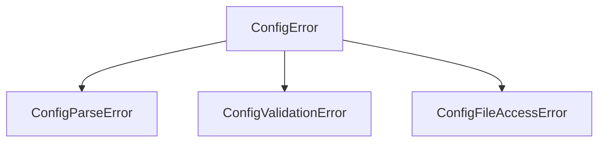
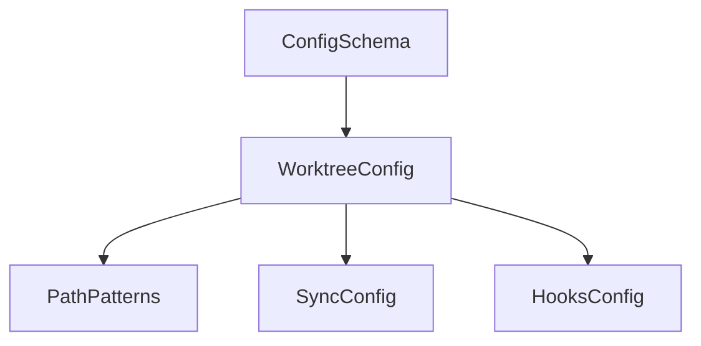

# Configuration

Rig uses a layered TOML configuration system that supports user-wide defaults, directory-based project groups, and project-specific settings. Configuration is represented internally using immutable dataclasses that can be inspected and used programmatically.

## Overview

The configuration system is built around frozen dataclasses that represent the schema. All configuration objects are immutable once created, which ensures thread safety and prevents accidental modification.

## File locations

Rig looks for configuration files in multiple locations, each representing a different scope:

| Location | Layer | Purpose |
|----------|-------|---------|
| `~/.local/rig/config.toml` | Global | User-wide defaults |
| `.rig.toml` in ancestor directories | Ancestor | Group-level configuration |
| `.rig.toml` in project root | Project | Project-specific settings |
| `.rig.local.toml` in project root | Local | Personal overrides (gitignored) |

### Path utilities

The `rig.config` module exports functions to get these standard paths:

```python
from pathlib import Path
from rig.config import (
    get_global_config_path,
    get_project_config_path,
    get_local_config_path,
)

# Global config path
global_path = get_global_config_path()  # ~/.local/rig/config.toml

# Project-specific paths (requires project root)
project_root = Path("/path/to/project")
project_path = get_project_config_path(project_root)  # /path/to/project/.rig.toml
local_path = get_local_config_path(project_root)  # /path/to/project/.rig.local.toml
```

These functions return paths without checking existence. Use the discovery functions to find files that actually exist.

## File discovery

The discovery module finds all configuration files in the resolution stack.

### discover_config_files

Discover all config files for a project, in resolution order:

```python
from pathlib import Path
from rig.config import discover_config_files, ConfigFile

project_root = Path("/home/user/projects/myapp")
config_files = discover_config_files(project_root)

for cf in config_files:
    status = "exists" if cf.exists else "not found"
    print(f"{cf.layer.value}: {cf.path} ({status})")
```

Output:

```text
global: /home/user/.local/rig/config.toml (not found)
ancestor: /home/user/projects/.rig.toml (exists)
project: /home/user/projects/myapp/.rig.toml (exists)
local: /home/user/projects/myapp/.rig.local.toml (not found)
```

The function returns all potential config file locations. Files that don't exist are included with `exists=False`, which is useful for understanding the full resolution stack.

**Arguments:**

| Argument | Type | Description |
|----------|------|-------------|
| `project_root` | `Path` | Absolute path to the project root directory |
| `home_dir` | `Path \| None` | Home directory boundary (defaults to `Path.home()`) |

**Returns:** `tuple[ConfigFile, ...]` in resolution order.

### find_ancestor_configs

Find `.rig.toml` files in ancestor directories:

```python
from pathlib import Path
from rig.config import find_ancestor_configs

project_root = Path("/home/user/projects/myapp")
ancestors = find_ancestor_configs(project_root)

# Returns paths in farthest-to-nearest order
for path in ancestors:
    print(path)
```

Output:

```text
/home/user/.rig.toml
/home/user/projects/.rig.toml
```

The search walks up from the start directory and stops at the home directory or filesystem root. The start directory itself is not included (that's the project config).

**Arguments:**

| Argument | Type | Description |
|----------|------|-------------|
| `start` | `Path` | Directory to start searching from |
| `home_dir` | `Path \| None` | Stop boundary (defaults to `Path.home()`) |

**Returns:** `tuple[Path, ...]` of existing `.rig.toml` files, farthest first.

### ConfigFile

A frozen dataclass representing a discovered configuration file:

```python
from dataclasses import dataclass
from pathlib import Path
from rig.config import ConfigLayer, ConfigSchema

@dataclass(slots=True, frozen=True)
class ConfigFile:
    path: Path
    layer: ConfigLayer
    exists: bool
    content: ConfigSchema | None = None
```

**Attributes:**

| Attribute | Type | Description |
|-----------|------|-------------|
| `path` | `Path` | Absolute path to the config file |
| `layer` | `ConfigLayer` | Which configuration layer this file belongs to |
| `exists` | `bool` | Whether the file exists on disk |
| `content` | `ConfigSchema \| None` | Parsed content if loaded, `None` otherwise |

## Parsing

The parser reads TOML files and constructs `ConfigSchema` objects.

### parse_config_file

Parse a config file into a `ConfigSchema`:

```python
from pathlib import Path
from rig.config import parse_config_file

path = Path("/path/to/project/.rig.toml")
config = parse_config_file(path)

# Access parsed values
print(config.worktree.default_location)
print(config.worktree.sync.link)
```

The parser handles:

- Reading and decoding the file as UTF-8
- Parsing TOML syntax
- Validating structure against the schema
- Converting keys from kebab-case to snake_case
- Constructing immutable dataclass instances

**Arguments:**

| Argument | Type | Description |
|----------|------|-------------|
| `path` | `Path` | Absolute path to the config file |

**Returns:** `ConfigSchema` with parsed values.

**Raises:**

| Exception | When |
|-----------|------|
| `ConfigFileAccessError` | File cannot be read |
| `ConfigParseError` | File contains invalid TOML syntax |
| `ConfigValidationError` | Structure or values are invalid |

### Key conversion

TOML uses kebab-case by convention, while Python uses snake_case. The parser automatically converts keys:

| TOML key | Python attribute |
|----------|------------------|
| `default-location` | `default_location` |
| `delete-branch` | `delete_branch` |
| `extend-post-add` | `extend_post_add` |

Example TOML file:

```toml
[worktree]
default-location = "local"
delete-branch = false

[worktree.sync]
extend-link = [".envrc", "CLAUDE.md"]
```

Parsed result:

```python
config.worktree.default_location  # "local"
config.worktree.delete_branch     # False
config.worktree.sync.extend_link  # (".envrc", "CLAUDE.md")
```

## Errors

The configuration system uses a hierarchy of exceptions for different error conditions.



### ConfigError

Base exception for all configuration errors. Catch this to handle any config-related error:

```python
from rig.config import ConfigError, parse_config_file

try:
    config = parse_config_file(path)
except ConfigError as e:
    print(f"Configuration error: {e}")
```

### ConfigParseError

Raised when a file contains invalid TOML syntax:

```python
from dataclasses import dataclass
from pathlib import Path

@dataclass(slots=True, frozen=True)
class ConfigParseError(ConfigError):
    path: Path
    line: int | None
    column: int | None
    detail: str
```

**Attributes:**

| Attribute | Type | Description |
|-----------|------|-------------|
| `path` | `Path` | Path to the config file |
| `line` | `int \| None` | Line number (1-indexed) where error occurred |
| `column` | `int \| None` | Column number (1-indexed) where error occurred |
| `detail` | `str` | Error message from the TOML parser |

**Example output:** `Failed to parse /path/to/.rig.toml:5:12: Expected '=' after key`

### ConfigValidationError

Raised when the config structure or values are invalid:

```python
from dataclasses import dataclass
from pathlib import Path

@dataclass(slots=True, frozen=True)
class ConfigValidationError(ConfigError):
    path: Path
    key: str
    detail: str
```

**Attributes:**

| Attribute | Type | Description |
|-----------|------|-------------|
| `path` | `Path` | Path to the config file |
| `key` | `str` | Dot-notation key path where error occurred |
| `detail` | `str` | Description of the validation failure |

**Example outputs:**

- `Invalid config at /path/to/.rig.toml: [worktree] unknown key 'defualt-location' (did you mean 'default-location'?)`
- `Invalid config at /path/to/.rig.toml: [worktree.default-location] invalid value 'invalid' (must be one of: local, sibling)`
- `Invalid config at /path/to/.rig.toml: [worktree.sync] cannot specify both 'link' and 'extend-link' in the same file`

### ConfigFileAccessError

Raised when a file cannot be accessed:

```python
from dataclasses import dataclass
from pathlib import Path

@dataclass(slots=True, frozen=True)
class ConfigFileAccessError(ConfigError):
    path: Path
    detail: str
```

**Attributes:**

| Attribute | Type | Description |
|-----------|------|-------------|
| `path` | `Path` | Path to the config file |
| `detail` | `str` | Description of the access error |

**Example outputs:**

- `Cannot access /path/to/.rig.toml: permission denied`
- `Cannot access /path/to/.rig.toml: is a directory`

```python
from rig.config import ConfigSchema, WorktreeConfig

# Create a config with defaults
config = ConfigSchema()

# Access nested settings
print(config.worktree.default_location)  # "sibling"
print(config.worktree.delete_branch)     # True

# Create with custom values
custom = ConfigSchema(
    worktree=WorktreeConfig(
        default_location="local",
        delete_branch=False,
    )
)
```

## Schema reference

The configuration schema is organized hierarchically:



### ConfigSchema

The root configuration container. Currently contains only worktree configuration but is structured to allow future expansion.

```python
from dataclasses import dataclass, field

@dataclass(slots=True, frozen=True)
class ConfigSchema:
    worktree: WorktreeConfig = field(default_factory=WorktreeConfig)
```

**Attributes:**

| Attribute | Type | Default | Description |
|-----------|------|---------|-------------|
| `worktree` | `WorktreeConfig` | `WorktreeConfig()` | Worktree management configuration |

### WorktreeConfig

Contains all settings related to worktree creation, sync behavior, and lifecycle hooks.

```python
from dataclasses import dataclass, field
from typing import Literal

@dataclass(slots=True, frozen=True)
class WorktreeConfig:
    default_location: Literal["sibling", "local"] = "sibling"
    delete_branch: bool = True
    protected: bool = False
    paths: PathPatterns = field(default_factory=PathPatterns)
    sync: SyncConfig = field(default_factory=SyncConfig)
    hooks: HooksConfig = field(default_factory=HooksConfig)
```

**Attributes:**

| Attribute | Type | Default | Description |
|-----------|------|---------|-------------|
| `default_location` | `"sibling"` or `"local"` | `"sibling"` | Default placement strategy for new worktrees |
| `delete_branch` | `bool` | `True` | Whether to delete the branch when removing a worktree |
| `protected` | `bool` | `False` | Whether the worktree is protected from accidental removal |
| `paths` | `PathPatterns` | `PathPatterns()` | Path pattern templates for worktree locations |
| `sync` | `SyncConfig` | `SyncConfig()` | Configuration for syncing paths between worktrees |
| `hooks` | `HooksConfig` | `HooksConfig()` | Configuration for lifecycle hooks |

### PathPatterns

Path pattern templates for worktree locations. Patterns support placeholders that are expanded when creating worktrees.

```python
@dataclass(slots=True, frozen=True)
class PathPatterns:
    sibling: str = "../{repo}-{branch}"
    local: str = ".worktrees/{branch}"
    pr: str = "../{repo}-pr-{number}"
```

**Attributes:**

| Attribute | Type | Default | Description |
|-----------|------|---------|-------------|
| `sibling` | `str` | `"../{repo}-{branch}"` | Template for sibling worktrees (alongside main repo) |
| `local` | `str` | `".worktrees/{branch}"` | Template for local worktrees (inside repo) |
| `pr` | `str` | `"../{repo}-pr-{number}"` | Template for pull request worktrees |

**Placeholders:**

- `{repo}` - Repository name
- `{branch}` - Branch name with slashes converted to dashes
- `{number}` - Pull request number

### SyncConfig

Configuration for syncing paths between worktrees. Supports both base lists and extend/exclude modifiers for layered configuration.

```python
@dataclass(slots=True, frozen=True)
class SyncConfig:
    link: tuple[str, ...] = ()
    copy: tuple[str, ...] = ()
    extend_link: tuple[str, ...] = ()
    extend_copy: tuple[str, ...] = ()
    exclude_link: tuple[str, ...] = ()
    exclude_copy: tuple[str, ...] = ()
```

**Attributes:**

| Attribute | Type | Default | Description |
|-----------|------|---------|-------------|
| `link` | `tuple[str, ...]` | `()` | Paths to symlink from the main worktree |
| `copy` | `tuple[str, ...]` | `()` | Paths to copy from the main worktree |
| `extend_link` | `tuple[str, ...]` | `()` | Additional paths to add to the link list |
| `extend_copy` | `tuple[str, ...]` | `()` | Additional paths to add to the copy list |
| `exclude_link` | `tuple[str, ...]` | `()` | Paths to remove from the link list |
| `exclude_copy` | `tuple[str, ...]` | `()` | Paths to remove from the copy list |

The `extend_*` and `exclude_*` attributes are used during configuration merging to allow downstream configs to modify lists without completely replacing them.

### HooksConfig

Configuration for worktree lifecycle hooks. Hook commands receive worktree context via environment variables.

```python
@dataclass(slots=True, frozen=True)
class HooksConfig:
    post_add: tuple[str, ...] = ()
    pre_remove: tuple[str, ...] = ()
    extend_post_add: tuple[str, ...] = ()
    extend_pre_remove: tuple[str, ...] = ()
    exclude_post_add: tuple[str, ...] = ()
    exclude_pre_remove: tuple[str, ...] = ()
```

**Attributes:**

| Attribute | Type | Default | Description |
|-----------|------|---------|-------------|
| `post_add` | `tuple[str, ...]` | `()` | Commands to run after creating a worktree |
| `pre_remove` | `tuple[str, ...]` | `()` | Commands to run before removing a worktree |
| `extend_post_add` | `tuple[str, ...]` | `()` | Additional commands to add to post_add |
| `extend_pre_remove` | `tuple[str, ...]` | `()` | Additional commands to add to pre_remove |
| `exclude_post_add` | `tuple[str, ...]` | `()` | Commands to remove from post_add |
| `exclude_pre_remove` | `tuple[str, ...]` | `()` | Commands to remove from pre_remove |

## Type reference

### ConfigLayer

Enumeration identifying configuration layers. Layers are processed in order from lowest to highest precedence.

```python
from enum import Enum

class ConfigLayer(Enum):
    GLOBAL = "global"      # ~/.local/rig/config.toml
    ANCESTOR = "ancestor"  # .rig.toml in parent directories
    PROJECT = "project"    # .rig.toml in project root
    LOCAL = "local"        # .rig.local.toml (gitignored)
```

### LocationStrategy

Type alias for worktree placement strategy.

```python
LocationStrategy = Literal["sibling", "local"]
```

- `"sibling"` - Place worktrees alongside the main repository
- `"local"` - Place worktrees inside the repository in a hidden directory

### PathPlaceholder

Type alias for valid path pattern placeholders.

```python
PathPlaceholder = Literal["{repo}", "{branch}", "{number}"]
```

### OutputFormat

Type alias for configuration display output formats.

```python
OutputFormat = Literal["toml", "json"]
```

### LayerSpec

Union type for layer specifications in CLI commands.

```python
LayerSpec = ConfigLayer | str
```

Can be a `ConfigLayer` enum value or a string for special cases like `"ancestor:/path/to/.rig.toml"` to specify a particular ancestor config.

## Default values

| Key | Default value |
|-----|---------------|
| `worktree.default_location` | `"sibling"` |
| `worktree.delete_branch` | `True` |
| `worktree.protected` | `False` |
| `worktree.paths.sibling` | `"../{repo}-{branch}"` |
| `worktree.paths.local` | `".worktrees/{branch}"` |
| `worktree.paths.pr` | `"../{repo}-pr-{number}"` |
| `worktree.sync.link` | `()` |
| `worktree.sync.copy` | `()` |
| `worktree.hooks.post_add` | `()` |
| `worktree.hooks.pre_remove` | `()` |

## Programmatic usage

### Creating configuration objects

All schema classes are frozen dataclasses, so you create instances by passing keyword arguments:

```python
from rig.config import (
    ConfigSchema,
    WorktreeConfig,
    PathPatterns,
    SyncConfig,
    HooksConfig,
)

# Minimal configuration
config = ConfigSchema()

# Custom worktree settings
config = ConfigSchema(
    worktree=WorktreeConfig(
        default_location="local",
        delete_branch=False,
        paths=PathPatterns(
            local=".wt/{branch}",
        ),
        sync=SyncConfig(
            link=(".envrc", "CLAUDE.md"),
        ),
        hooks=HooksConfig(
            post_add=("uv sync", "pre-commit install"),
        ),
    )
)
```

### Accessing values

```python
config = ConfigSchema()

# Dot notation for nested access
location = config.worktree.default_location
sibling_path = config.worktree.paths.sibling
link_paths = config.worktree.sync.link
```

### Immutability

All configuration objects are frozen. Attempting to modify them raises an error:

```python
config = ConfigSchema()
config.worktree.protected = True  # Raises FrozenInstanceError
```

To create a modified configuration, use `dataclasses.replace()`:

```python
from dataclasses import replace

config = ConfigSchema()
new_config = replace(
    config,
    worktree=replace(
        config.worktree,
        protected=True,
    ),
)
```

## Coming in future releases

The following features are planned but not yet implemented.

### Worktree-specific config

A fifth configuration layer, `.rig.worktree.toml`, will provide worktree-specific settings that override all other layers.

### Precedence and merging

Configuration layers will merge in order from most general to most specific. Scalar values will be replaced by downstream configs. List fields will support extend/exclude modifiers for incremental modification.

### CLI commands

The following commands are planned:

- `rig config show` - Display resolved configuration
- `rig config get` - Get a single value for scripting
- `rig config set` - Set a value in a configuration layer
- `rig config unset` - Remove a key from a configuration layer
- `rig config edit` - Open a config file in your editor
- `rig config inspect` - Show all config files in resolution stack
- `rig config where` - Show which layer provides a key's value

See the [specification](../specs/rig-config.md) for full details on planned features.
